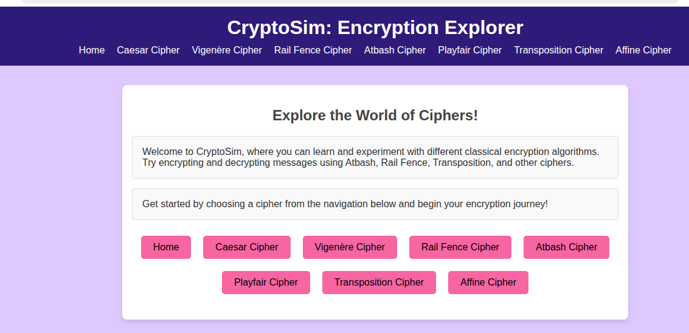

# 🔐 CryptoSim – Encryption Explorer

CryptoSim – Encryption Explorer is a web-based educational project designed to help users understand and experiment with **classical cryptographic encryption techniques**.  
The project provides an interactive and beginner-friendly interface where users can encrypt and decrypt messages using different cipher algorithms and immediately see the results.

This tool is especially useful for **students, beginners in cryptography, and cybersecurity enthusiasts** who want hands-on experience with encryption concepts.

---

## 📸 Project Screenshots & Demo

You can add screenshots, diagrams, or animated GIFs here to visually demonstrate the project.

```md



```
